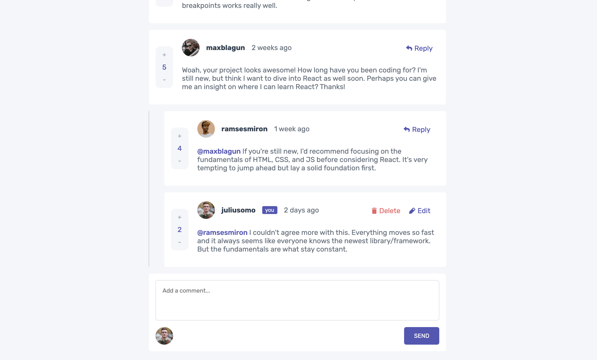
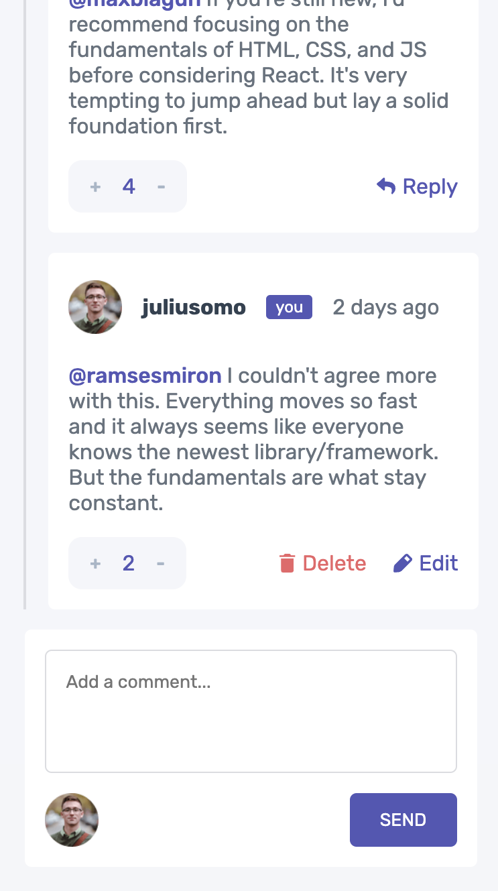

# Frontend Mentor - Interactive comments section solution

This is a solution to the [Interactive comments section challenge on Frontend Mentor](https://www.frontendmentor.io/challenges/interactive-comments-section-iG1RugEG9). Frontend Mentor challenges help you improve your coding skills by building realistic projects. 

## Table of contents

- [Overview](#overview)
  - [The challenge](#the-challenge)
  - [Screenshot](#screenshot)
  - [Links](#links)
- [My process](#my-process)
  - [Built with](#built-with)
  - [What I learned](#what-i-learned)
  - [Continued development](#continued-development)
- [Author](#author)

### The challenge

Users should be able to:

- View the optimal layout for the app depending on their device's screen size
- See hover states for all interactive elements on the page
- Create, Read, Update, and Delete comments and replies
- Upvote and downvote comments
- **Bonus**: If you're building a purely front-end project, use `localStorage` to save the current state in the browser that persists when the browser is refreshed.
- **Bonus**: Instead of using the `createdAt` strings from the `data.json` file, try using timestamps and dynamically track the time since the comment or reply was posted.

### Screenshot

Desktop version:


Mobile version: 


### Links

- Solution URL: [Add solution URL here](https://github.com/nicol29/interactive-comments-section-fm)
- Live Site URL: [Add live site URL here](https://nicol29.github.io/interactive-comments-section-fm/)

## My process

- Mobile first approach
- I first thought of the structure of my html markup.
- Afterwards I styled comments to closely resemble the design provided.
- I began implementing the crud operations using useReducer().
- Finally, refined any code and styling.


### Built with

- Semantic HTML5 markup
- CSS custom properties
- Flexbox
- Mobile-first workflow
- [React](https://reactjs.org/) - JS library

### What I learned

I became more familiar with some react hooks I have not really used in the past, some of these hooks being the useRef() hook and the useReducer() hook. By using the useReducer hook in particular it simplified managing and performing the crud operations on each individual comment by keep this logic seperate from the component. 

I also learned how to properly style and implement modals. I have implemented modals in the past but could never style them appropriately, by adding the follow style I was able to generate a semi transparent background which covered the whole page even when scrolled: 

```css
.modal-bg {
  background-color: rgba(0, 0, 0, 0.495);
  display: flex;
  justify-content: center;
  align-items: center;
  position: fixed;
  z-index: 1;
  left: 0;
  top: 0;
  width: 100%;
  height: 100%;
  overflow: auto;
}
```

### Continued development

I would like to make my code cleaner in the future as I feel like some of it is spaghetti at times. I will try to adhere to SOLID principles when developing other projects in the future.

## Author

- Github - [nicol29](https://github.com/nicol29)
- Frontend Mentor - [@nicol29](https://www.frontendmentor.io/profile/nicol29)
